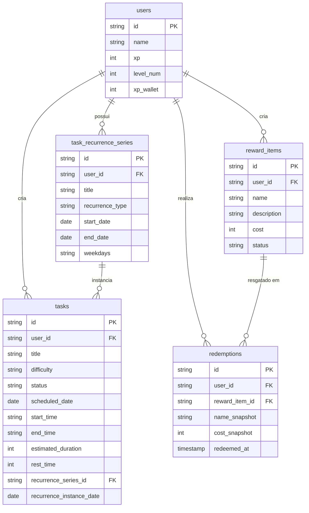

# Design Document — F1 Advanced Features

## Overview

Este documento descreve a arquitetura técnica das cinco features avançadas do **F1 Task Manager**: Calendar View, Tasks com Duração/Horário, Agenda com Conflict_Validator, Recorrência de Tasks e Pit Stop Shop. O sistema é uma aplicação Next.js 16 (App Router) com Oracle Autonomous Database acessado diretamente via `oracledb` (thin mode) e autenticação via NextAuth com JWT.

O design estende o modelo existente — que já possui tasks com dificuldade, XP, níveis e Pomodoro fixo de 25 min — sem breaking changes na API atual. Todos os novos campos são opcionais nas tasks existentes. As cinco features são acopladas ao mesmo conjunto de dados de tasks do usuário e ao sistema de XP, mas operam de forma independente entre si, exceto onde há integração explícita (XP_Wallet + conclusão de task, Pomodoro + duração estimada).

---

## Architecture

### Stack e Padrões Existentes

- **Next.js 16 App Router** — Route Handlers em `app/api/`
- **Oracle Autonomous Database** — acesso via `lib/oracle.ts` (`query<T>` e `execute`)
- **NextAuth JWT** — token com `id`, `xp`, `level` do usuário
- **Tailwind CSS + shadcn/ui** — componentes de UI
- **Prisma** — schema de referência (não usado em runtime; o app usa Oracle diretamente)

### Estratégia Geral de Extensão

```
┌──────────────────────────────────────────────────────────────┐
│                     Next.js App Router                       │
│                                                              │
│  app/                                                        │
│  ├── dashboard/          (existente)                         │
│  ├── calendar/           (novo)                              │
│  ├── agenda/             (novo)                              │
│  └── pit-stop-shop/      (novo)                              │
│                                                              │
│  app/api/                                                    │
│  ├── tasks/              (estendido: novos campos)           │
│  ├── calendar/           (novo: GET por período)             │
│  ├── agenda/             (novo: GET semanal + validação)     │
│  ├── recurrence/         (novo: CRUD de séries)              │
│  └── pit-stop-shop/      (novo: wallet, items, redemptions)  │
└──────────────────────────────────────────────────────────────┘
│
▼
┌──────────────────────────────────────────────────────────────┐
│              lib/ (lógica de domínio puro)                   │
│                                                              │
│  lib/conflict-validator.ts   — Conflict_Validator            │
│  lib/recurrence-engine.ts    — Recurrence_Engine             │
│  lib/pomodoro-utils.ts       — cálculos de Pomodoro          │
│  lib/time-utils.ts           — utilitários de data/hora      │
│  lib/xp-wallet.ts            — operações de XP_Wallet        │
└──────────────────────────────────────────────────────────────┘
│
▼
┌──────────────────────────────────────────────────────────────┐
│              Oracle Autonomous Database                      │
│  Tabelas novas: task_recurrence_series, reward_items,        │
│                 redemptions                                  │
│  Tabela alterada: tasks (novos campos opcionais),            │
│                   users (novo campo xp_wallet)               │
└──────────────────────────────────────────────────────────────┘
```

### Princípios de Design

1. **Lógica de domínio pura em `lib/`** — `Conflict_Validator` e `Recurrence_Engine` são funções puras testáveis sem dependência de banco ou HTTP.
2. **Novos campos são opcionais** — tasks sem `scheduled_date`, `start_time` etc. continuam funcionando exatamente como antes.
3. **Atomicidade via Oracle transactions** — o crédito duplo de XP (progressão + wallet) usa `autoCommit: false` com commit explícito.
4. **Performance de validação** — `Conflict_Validator` opera sobre um conjunto de tasks já carregado em memória (máximo do dia = ~96 slots de 15 min), garantindo < 500ms.

---

## Components and Interfaces

### 1. Calendar Module

**Componente:** `app/calendar/page.tsx`  
**API:** `app/api/calendar/route.ts`

```typescript
// GET /api/calendar?year=2025&month=6        → tasks do mês
// GET /api/calendar?year=2025&week=24        → tasks da semana
interface CalendarQueryParams {
  year: number;
  month?: number;   // 1-12, para view mensal
  week?: number;    // ISO week number, para view semanal
}

interface CalendarTask {
  id: string;
  title: string;
  difficulty: 'SOFT' | 'MEDIUM' | 'HARD';
  status: string;
  scheduledDate: string | null;   // 'YYYY-MM-DD'
  startTime: string | null;       // 'HH:MM'
  endTime: string | null;         // 'HH:MM'
  recurrenceSeriesId: string | null;
}

// Função pura de agrupamento (lib/time-utils.ts)
function groupTasksByDay(tasks: CalendarTask[]): Record<string, CalendarTask[]>
function getOverflowDisplay(tasks: CalendarTask[]): { visible: CalendarTask[]; overflowCount: number }
```

### 2. Conflict Validator (`lib/conflict-validator.ts`)

Função pura — não acessa banco diretamente. Recebe a lista de tasks existentes já filtrada.

```typescript
interface TimeBlock {
  taskId: string;
  title: string;
  startTime: string;   // 'HH:MM'
  endTime: string;     // 'HH:MM'
  restTime: number;    // minutos
  status: 'GARAGE' | 'COMPLETED';
}

interface ConflictResult {
  hasConflict: boolean;
  conflictingTask?: {
    title: string;
    startTime: string;
    endTime: string;
  };
  nextAvailableTime?: string;  // 'HH:MM'
  message?: string;
}

function validateConflict(
  newBlock: Omit<TimeBlock, 'taskId' | 'title' | 'status'>,
  existingBlocks: TimeBlock[]
): ConflictResult

// Algoritmo: para cada bloco existente com status GARAGE | COMPLETED e start+end definidos:
// conflito se newStart < (existingEnd + existingRestTime) && newEnd > existingStart
```

### 3. Recurrence Engine (`lib/recurrence-engine.ts`)

```typescript
type RecurrenceType = 'NONE' | 'DAILY' | 'WEEKLY' | 'PERIOD';

interface RecurrenceConfig {
  type: RecurrenceType;
  startDate: string;           // 'YYYY-MM-DD'
  endDate: string;             // 'YYYY-MM-DD'
  weekdays?: number[];         // 0=Dom ... 6=Sab, para WEEKLY
}

interface RecurrenceGenerationResult {
  instances: Array<{ scheduledDate: string; status: 'GARAGE' | 'SKIPPED' }>;
  skippedDates: string[];
  totalGenerated: number;
  error?: string;  // ex: "geraria N instâncias, limite 365"
}

function generateRecurrenceInstances(
  config: RecurrenceConfig,
  existingConflicts: Set<string>   // datas que colidem
): RecurrenceGenerationResult

function countInstances(config: RecurrenceConfig): number
```

### 4. Pomodoro Utils (`lib/pomodoro-utils.ts`)

```typescript
interface PomodoroConfig {
  focusMinutes: number;
  restMinutes: number;
}

interface TaskWithTiming {
  estimatedDuration: number | null;  // minutos
  restTime: number | null;           // minutos
}

// Função pura: inicializa configuração do Pomodoro a partir de uma task
function initPomodoroFromTask(task: TaskWithTiming): PomodoroConfig
// → { focusMinutes: task.estimatedDuration ?? 25, restMinutes: task.restTime ?? 5 }
```

### 5. Pit Stop Shop (`app/api/pit-stop-shop/`)

```typescript
// Routes:
// GET  /api/pit-stop-shop/wallet           → saldo atual
// GET  /api/pit-stop-shop/items            → reward items ativos do usuário
// POST /api/pit-stop-shop/items            → criar reward item
// PATCH /api/pit-stop-shop/items/[id]      → editar / desativar
// POST /api/pit-stop-shop/redeem           → resgatar item
// GET  /api/pit-stop-shop/redemptions      → histórico

interface RewardItem {
  id: string;
  userId: string;
  name: string;         // 1–100 chars
  description: string;  // 0–500 chars
  cost: number;         // inteiro > 0
  status: 'ACTIVE' | 'INACTIVE';
  createdAt: string;
}

interface Redemption {
  id: string;
  userId: string;
  rewardItemId: string;
  nameSnapshot: string;
  costSnapshot: number;
  redeemedAt: string;   // ISO timestamp
}

interface RedeemRequest {
  rewardItemId: string;
}

interface RedeemResult {
  success: boolean;
  newWalletBalance?: number;
  redemption?: Redemption;
  error?: string;
}
```

### 6. XP Wallet (`lib/xp-wallet.ts`)

```typescript
// Operação atômica de crédito — chamada dentro de completarTask
async function creditXpBoth(
  conn: oracledb.Connection,
  userId: string,
  amount: number
): Promise<void>
// Executa dois UPDATEs na mesma conexão com autoCommit: false,
// depois commit manual. Em caso de erro, rollback.

async function debitWallet(
  conn: oracledb.Connection,
  userId: string,
  amount: number
): Promise<{ success: boolean; newBalance: number; error?: string }>
```

---

## Data Models

### Alterações na tabela `tasks` (novos campos opcionais)

```sql
ALTER TABLE tasks ADD (
  scheduled_date  DATE,                        -- data agendada (sem hora)
  start_time      VARCHAR2(5),                 -- 'HH:MM'
  end_time        VARCHAR2(5),                 -- 'HH:MM'
  estimated_duration NUMBER(4),                -- minutos, 1–1440
  rest_time       NUMBER(2) DEFAULT 5,         -- minutos, 1–60
  recurrence_series_id VARCHAR2(36),           -- FK para task_recurrence_series
  recurrence_instance_date DATE                -- data desta instância na série
);
-- status já existe: adicionar 'SKIPPED' como valor válido
```

### Nova tabela `task_recurrence_series`

```sql
CREATE TABLE task_recurrence_series (
  id              VARCHAR2(36)   PRIMARY KEY,
  user_id         VARCHAR2(36)   NOT NULL,
  title           VARCHAR2(255)  NOT NULL,
  difficulty      VARCHAR2(10)   NOT NULL,
  recurrence_type VARCHAR2(20)   NOT NULL,  -- DAILY | WEEKLY | PERIOD
  start_date      DATE           NOT NULL,
  end_date        DATE           NOT NULL,
  weekdays        VARCHAR2(20),             -- ex: '1,3,5' para seg/qua/sex
  estimated_duration NUMBER(4),
  rest_time       NUMBER(2) DEFAULT 5,
  start_time      VARCHAR2(5),
  end_time        VARCHAR2(5),
  created_at      TIMESTAMP DEFAULT CURRENT_TIMESTAMP,
  FOREIGN KEY (user_id) REFERENCES users(id)
);
```

### Alteração na tabela `users` (XP_Wallet)

```sql
ALTER TABLE users ADD (
  xp_wallet NUMBER DEFAULT 0 NOT NULL
);
-- Constraint: xp_wallet >= 0
```

### Nova tabela `reward_items`

```sql
CREATE TABLE reward_items (
  id          VARCHAR2(36)    PRIMARY KEY,
  user_id     VARCHAR2(36)    NOT NULL,
  name        VARCHAR2(100)   NOT NULL,
  description VARCHAR2(500),
  cost        NUMBER          NOT NULL,    -- > 0
  status      VARCHAR2(10)    DEFAULT 'ACTIVE',  -- ACTIVE | INACTIVE
  created_at  TIMESTAMP DEFAULT CURRENT_TIMESTAMP,
  updated_at  TIMESTAMP DEFAULT CURRENT_TIMESTAMP,
  CONSTRAINT chk_cost_positive CHECK (cost > 0),
  CONSTRAINT chk_status CHECK (status IN ('ACTIVE','INACTIVE')),
  FOREIGN KEY (user_id) REFERENCES users(id)
);
```

### Nova tabela `redemptions`

```sql
CREATE TABLE redemptions (
  id              VARCHAR2(36)    PRIMARY KEY,
  user_id         VARCHAR2(36)    NOT NULL,
  reward_item_id  VARCHAR2(36)    NOT NULL,
  name_snapshot   VARCHAR2(100)   NOT NULL,
  cost_snapshot   NUMBER          NOT NULL,
  redeemed_at     TIMESTAMP DEFAULT CURRENT_TIMESTAMP,
  FOREIGN KEY (user_id) REFERENCES users(id),
  FOREIGN KEY (reward_item_id) REFERENCES reward_items(id)
);
CREATE INDEX idx_redemptions_user_date ON redemptions(user_id, redeemed_at DESC);
```

### Índices de performance para Calendar/Agenda

```sql
CREATE INDEX idx_tasks_user_date ON tasks(user_id, scheduled_date);
CREATE INDEX idx_tasks_series ON tasks(recurrence_series_id);
```

### Diagrama ER (simplificado)



---

## Correctness Properties

*A property is a characteristic or behavior that should hold true across all valid executions of a system — essentially, a formal statement about what the system should do. Properties serve as the bridge between human-readable specifications and machine-verifiable correctness guarantees.*

A ferramenta escolhida para property-based testing é **fast-check** (TypeScript), que integra naturalmente com Jest/Vitest já disponível no ecossistema Next.js.

---

### Property 1: Agrupamento de tasks por dia é exato

*Para qualquer* lista de tasks com `scheduledDate` definida, a função `groupTasksByDay` deve mapear cada task exatamente para a chave correspondente à sua `scheduledDate`, e nenhuma task deve aparecer sob chave diferente da sua data.

**Validates: Requirements 1.1**

---

### Property 2: Alternância de visualização preserva data de referência

*Para qualquer* estado de calendário com uma data de referência, alternar entre visualização mensal e semanal não deve modificar a data de referência mantida no estado.

**Validates: Requirements 1.3**

---

### Property 3: Overflow display respeita limite de 3 tasks visíveis

*Para qualquer* lista de tasks de um único dia, `getOverflowDisplay` deve retornar exatamente `min(count, 3)` tasks visíveis e um `overflowCount` de `max(0, count - 3)`. O rótulo "+N" deve aparecer somente quando `count > 3`.

**Validates: Requirements 1.4**

---

### Property 4: Cálculo de duração a partir de início e fim é correto

*Para qualquer* par de horários `(startTime, endTime)` onde `endTime > startTime` (representados como minutos desde meia-noite), `calculateDuration(start, end)` deve retornar exatamente `endTime - startTime` em minutos.

**Validates: Requirements 2.2**

---

### Property 5: Validação de fim <= início rejeita para qualquer par inválido

*Para qualquer* par de horários `(startTime, endTime)` onde `endTime <= startTime`, a função de validação de horário deve retornar um resultado de erro (não-sucesso), independentemente dos valores absolutos.

**Validates: Requirements 2.3**

---

### Property 6: Cálculo de horário de fim a partir de início e duração é correto

*Para qualquer* horário de início `S` (em minutos desde meia-noite, 0–1439) e duração `D` (1–1440), `calculateEndTime(S, D)` deve retornar `(S + D)` minutos, com flag de "ultrapassa meia-noite" quando `S + D > 1440`.

**Validates: Requirements 2.4**

---

### Property 7: Pomodoro inicializado com dados corretos da task

*Para qualquer* task com `estimatedDuration` definida (1–1440), `initPomodoroFromTask(task).focusMinutes` deve ser igual a `task.estimatedDuration`. Para qualquer task com `restTime` definido, `initPomodoroFromTask(task).restMinutes` deve ser igual a `task.restTime`. Para tasks sem `estimatedDuration`, o resultado deve ser 25; para tasks sem `restTime`, o resultado deve ser 5.

**Validates: Requirements 2.6, 2.8**

---

### Property 8: Card de task exibe campos de tempo sse presentes

*Para qualquer* task, a função de rendering do card deve incluir informação de horário/duração se e somente se `startTime` ou `estimatedDuration` for não-nulo. Quando ambos são nulos, nenhum elemento de tempo deve aparecer no output.

**Validates: Requirements 2.9**

---

### Property 9: Conflict_Validator detecta sobreposição corretamente

*Para qualquer* `newBlock` com `(newStart, newEnd)` e qualquer `existingBlock` com `(existStart, existEnd, restTime)` com status `GARAGE` ou `COMPLETED`, `validateConflict` deve retornar `hasConflict: true` se e somente se `newStart < (existEnd + restTime)` e `newEnd > existStart`. Para entradas sem sobreposição, deve retornar `hasConflict: false`.

**Validates: Requirements 3.2, 3.3, 3.4**

---

### Property 10: Conflict_Validator filtra corretamente por status

*Para qualquer* lista de tasks com status misturados, o pré-filtro do `Conflict_Validator` deve retornar apenas tasks com status `GARAGE` ou `COMPLETED`. Tasks com status `DELETED` ou `SKIPPED` nunca devem aparecer na lista de candidatos a conflito. Tasks sem `startTime` ou `endTime` definidos também devem ser excluídas.

**Validates: Requirements 3.5, 3.6**

---

### Property 11: Agenda semanal ordena tasks por horário de início

*Para qualquer* lista de tasks com `startTime` definido, a função de ordenação da Agenda deve retornar uma lista onde `tasks[i].startTime <= tasks[i+1].startTime` para todo índice `i`. A altura visual de cada task deve ser proporcional à sua `estimatedDuration`.

**Validates: Requirements 3.8**

---

### Property 12: Geração diária/período produz instâncias para cada dia do intervalo

*Para qualquer* data de início `D` e data de fim `F` com `F >= D`, `generateRecurrenceInstances({ type: 'DAILY', startDate: D, endDate: F })` deve produzir exatamente `daysBetween(D, F) + 1` instâncias, uma para cada dia do intervalo fechado `[D, F]`.

**Validates: Requirements 4.2, 4.4**

---

### Property 13: Geração semanal respeita os dias selecionados

*Para qualquer* intervalo de datas `[D, F]` e conjunto não-vazio de dias da semana `W`, todas as instâncias geradas por `generateRecurrenceInstances({ type: 'WEEKLY', weekdays: W })` devem ter `dayOfWeek(instance.scheduledDate) ∈ W`. Nenhuma instância deve cair em dia da semana fora de `W`.

**Validates: Requirements 4.3**

---

### Property 14: Limite de 365 instâncias é aplicado

*Para qualquer* configuração de recorrência que produziria mais de 365 instâncias (verificado por `countInstances(config) > 365`), `generateRecurrenceInstances` deve retornar um erro e zero instâncias criadas. Para configurações que produzem <= 365 instâncias, deve ter sucesso.

**Validates: Requirements 4.7**

---

### Property 15: Conclusão de instância recorrente afeta apenas aquela instância

*Para qualquer* série recorrente com N instâncias (N >= 2) e qualquer instância `i` da série, completar a instância `i` deve resultar em: `instances[i].status === 'COMPLETED'` e `instances[j].status` inalterado para todo `j != i`.

**Validates: Requirements 4.5**

---

### Property 16: Geração parcial com conflitos — instâncias não-conflitantes criadas, conflitantes marcadas SKIPPED

*Para qualquer* série recorrente e conjunto de datas conflitantes `C` (subconjunto das datas geradas), o resultado deve conter: instâncias com status `GARAGE` para datas fora de `C`, instâncias com status `SKIPPED` para datas em `C`, e a lista `skippedDates` deve ser exatamente `C`.

**Validates: Requirements 4.8**

---

### Property 17: Card de task recorrente exibe ícone de recorrência sse série presente

*Para qualquer* task, a função de rendering do card deve incluir o elemento de ícone de recorrência se e somente se `recurrenceSeriesId` for não-nulo. Tasks sem `recurrenceSeriesId` não devem exibir o ícone.

**Validates: Requirements 4.9**

---

### Property 18: XP_Wallet nunca é negativa após qualquer sequência de operações

*Para qualquer* sequência de operações de crédito (conclusão de task) e débito (resgate), o saldo da `XP_Wallet` deve ser sempre >= 0 após cada operação. A função `debitWallet` deve rejeitar qualquer operação que levaria o saldo abaixo de zero.

**Validates: Requirements 5.1, 5.7**

---

### Property 19: Crédito de XP é simétrico entre progressão e wallet

*Para qualquer* task completada com `xpGained = G`, após a operação atômica: `user.xp` deve ter aumentado em `G` e `user.xp_wallet` deve ter aumentado em `G`. A variação dos dois campos deve ser idêntica.

**Validates: Requirements 5.2**

---

### Property 20: Validação de Reward_Item aceita entradas válidas e rejeita inválidas

*Para qualquer* combinação de `(name, description, cost)`, a função de validação de `RewardItem` deve aceitar quando `1 <= name.length <= 100`, `description.length <= 500` e `cost >= 1` (inteiro). Deve rejeitar para `name.length === 0`, `name.length > 100`, `description.length > 500`, `cost <= 0` ou `cost` não-inteiro.

**Validates: Requirements 5.3**

---

### Property 21: Resgate debita wallet e registra snapshot correto

*Para qualquer* `RewardItem` ativo com `cost = C` e `XP_Wallet` com saldo `W >= C`, após uma operação de resgate bem-sucedida: `newWallet = W - C`, e o registro de `Redemption` deve conter `nameSnapshot === item.name` (ao momento do resgate) e `costSnapshot === C`.

**Validates: Requirements 5.6**

---

### Property 22: Resgate de item inativo é sempre rejeitado

*Para qualquer* `RewardItem` com `status !== 'ACTIVE'` e qualquer saldo de `XP_Wallet`, a operação de resgate deve retornar erro `"Este item não está mais disponível"` sem debitar o saldo.

**Validates: Requirements 5.11**

---

### Property 23: Histórico de resgates ordenado por data decrescente

*Para qualquer* lista de `Redemption`s de um usuário, a função de listagem do histórico deve retornar os registros com `redeemed_at` em ordem não-crescente (do mais recente ao mais antigo).

**Validates: Requirements 5.8**

---

### Property 24: Edição de Reward_Item não altera snapshots de Redemptions existentes

*Para qualquer* `RewardItem` com `K` resgates registrados, editar `name` ou `cost` do item não deve alterar `nameSnapshot` nem `costSnapshot` de nenhum dos `K` resgates existentes.

**Validates: Requirements 5.5**

---

## Error Handling

### Conflict Validator
- Retorna `ConflictResult` com `hasConflict: true` e mensagem formatada `"Conflito com '[título]' (HH:MM–HH:MM). Próximo horário disponível: HH:MM."`
- O campo `nextAvailableTime` é calculado como `existEnd + existRestTime` do conflito mais tardio encontrado
- HTTP 409 do Route Handler quando há conflito

### Recurrence Engine
- Limite de 365 instâncias: retorna `{ error: "O período selecionado geraria N instâncias. O limite é 365. Reduza o período para continuar." }` com HTTP 422
- Instâncias conflitantes: retorna resultado parcial com `skippedDates` e HTTP 207 (Multi-Status)
- Data de fim anterior à data de início: HTTP 400

### Task Timing Validation
- `endTime <= startTime`: HTTP 400 com mensagem `"Horário de fim deve ser posterior ao horário de início"`
- `startTime + duration > 1440`: HTTP 200 com aviso no response body `"A tarefa ultrapassa meia-noite"` (não bloqueia)

### Pit Stop Shop
- XP insuficiente: HTTP 402 com `"XP insuficiente. Você tem N XP e precisa de M XP. Faltam X XP."`
- Item inativo: HTTP 410 com `"Este item não está mais disponível"`
- Falha atômica no crédito de XP: rollback completo, HTTP 500, nenhum campo alterado

### Calendar / Agenda
- Falha na requisição: componente exibe mensagem de erro com botão "Tentar novamente"; controles de navegação permanecem habilitados (Requirement 1.9)
- Período inválido (ex: week fora de 1–53): HTTP 400

---

## Testing Strategy

### Abordagem Dual

**Testes unitários (exemplo)**: casos específicos, edge cases, integrações entre componentes  
**Testes de propriedade (fast-check)**: propriedades universais sobre lógica pura

### Setup

```bash
npm install --save-dev fast-check vitest @vitest/coverage-v8
```

Arquivo de configuração: `vitest.config.ts` na raiz do projeto.

### Testes de Propriedade (fast-check)

Cada propriedade do design document deve ser implementada como um único teste usando `fc.assert(fc.property(...))` com **mínimo de 100 iterações** (padrão do fast-check). Os geradores de entrada devem cobrir edge cases automaticamente (strings vazias, valores limite, listas vazias).

Tag de referência em cada teste:
```typescript
// Feature: f1-advanced-features, Property N: <descrição da propriedade>
```

Localização dos testes de propriedade: `lib/__tests__/` (junto às funções puras testadas).

**Funções alvo para PBT:**
- `lib/conflict-validator.ts` → Properties 9, 10
- `lib/recurrence-engine.ts` → Properties 12, 13, 14, 15, 16
- `lib/time-utils.ts` → Properties 4, 5, 6
- `lib/pomodoro-utils.ts` → Property 7
- `app/calendar/utils.ts` → Properties 1, 2, 3, 8
- `app/pit-stop-shop/utils.ts` → Properties 18, 20, 21, 22, 23, 24
- `app/pit-stop-shop/components/TaskCard.tsx` → Properties 17

### Testes de Exemplo (unitários)

Localização: `app/**/__tests__/` próximos aos componentes.

Cobertura esperada:
- `Requirement 2.5`: task criada sem rest_time → persiste com valor 5
- `Requirement 2.7`: Pomodoro para em ≤ 1s após task concluída
- `Requirement 4.1`: formulário exibe 4 opções de recorrência
- `Requirement 4.6`: diálogo de exclusão exibe 2 opções
- `Requirement 5.9`: dois labels distintos para wallet e XP de progressão

### Testes de Integração / Smoke

- `Requirement 3.7`: validação de conflito retorna em < 500ms (teste de performance com banco mock)
- `Requirement 1.8`: navegação de calendário dispara query com período correto
- `Requirement 5.10`: atualização de wallet reflete na UI em ≤ 2s

### Convenção de Nomes

```
lib/__tests__/conflict-validator.property.test.ts
lib/__tests__/recurrence-engine.property.test.ts
lib/__tests__/time-utils.property.test.ts
lib/__tests__/pomodoro-utils.property.test.ts
app/calendar/__tests__/utils.property.test.ts
app/pit-stop-shop/__tests__/utils.property.test.ts
```
